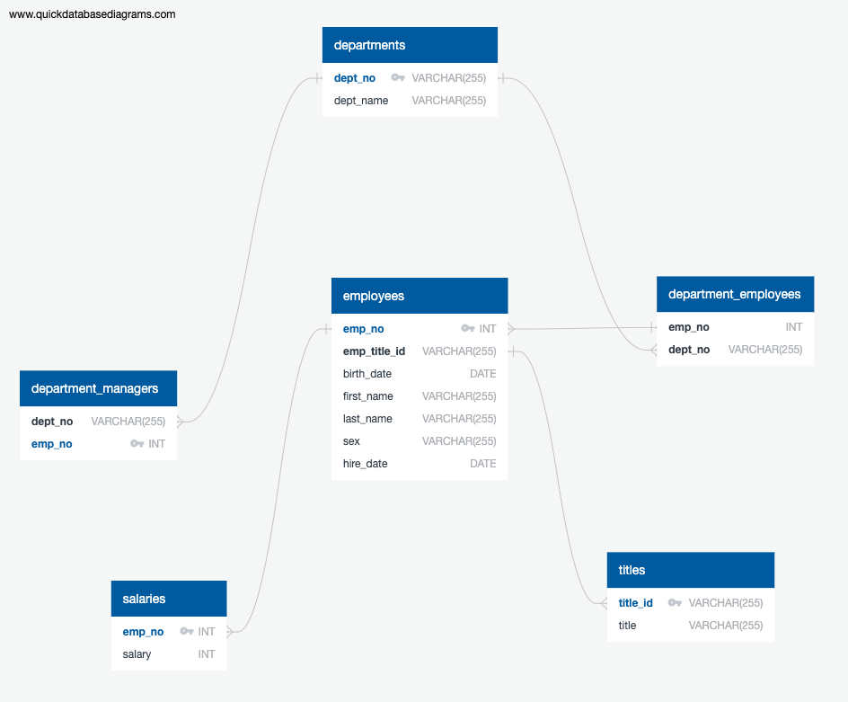

# SQL-Challenge 

*In this assignment, I’ll create tables based on provided data to manipulate and source required information, as well as, create ERD to showcase logic behind my actions.*

# Background
It’s been two weeks since you were hired as a new data engineer at Pewlett Hackard (a fictional company). Your first major task is to do a research project about people whom the company employed during the 1980s and 1990s. All that remains of the employee database from that period are six CSV files.

For this project, you’ll design the tables to hold the data from the CSV files, import the CSV files into a SQL database, and then answer questions about the data. That is, you’ll perform data modelling, data engineering, and data analysis, respectively.

This Challenge is divided into three parts: data modelling, data engineering, and data analysis.

# SQL-Challenge

## Data Modelling 

## Data Engineering
* Using the information provided in the given CSV files, I have sketched out an ERD of the tables. 
* In order to illustrate the Entity Relationship Diagram (ERD) I used QuickDBD. 
* I utilized the insights gained from ERD to construct a tbale schema for each of six CSV files. Specified apropirate data types, designated primary keys, established foreign keys and defined other constrains. 

Please note that in some cases, the use of a primary key has not been deemed necessary (e.g., Department Employees Table). I successfully managed to establish relationships without the need for a composite key, even though some data was duplicated in the CSV files.

* Subsequently, I successfully imported each of the CSV files to populate tables with data for analysis.

## Data Analysis
After creating table schemas I proceeded to analyse the data and answer the following questions: 
1. List the employee number, last name, first name, sex, and salary of each employee.

2. List the first name, last name, and hire date for the employees who were hired in 1986.

3. List the manager of each department along with their department number, department name, employee number, last name, and first name.

4. List the department number for each employee along with that employee’s employee number, last name, first name, and department name.

5. List the first name, last name, and sex of each employee whose first name is Hercules and whose last name begins with the letter B.

6. List each employee in the Sales department, including their employee number, last name, and first name.

7. List each employee in the Sales and Development departments, including their employee number, last name, first name, and department name.

8. List the frequency counts, in descending order, of all the employee last names (that is, how many employees share each last name).

#### Technologies used
* *Visual Studio Code*
* *Excel* 
* *GitHub* 
* **SQL**

#### File list
* Directory "EmployeeSQL" containing: tableschemata.sql, analysisqueries.sql, ERDDiagram255.png.
* Directory Data containing six CSV files used to populate the tables.
* Various Screen Shots
* README.md

Cover photo source: SQL injection by Scott Batary, https://medium.com/batary/sql-injection-384ce641ff5c